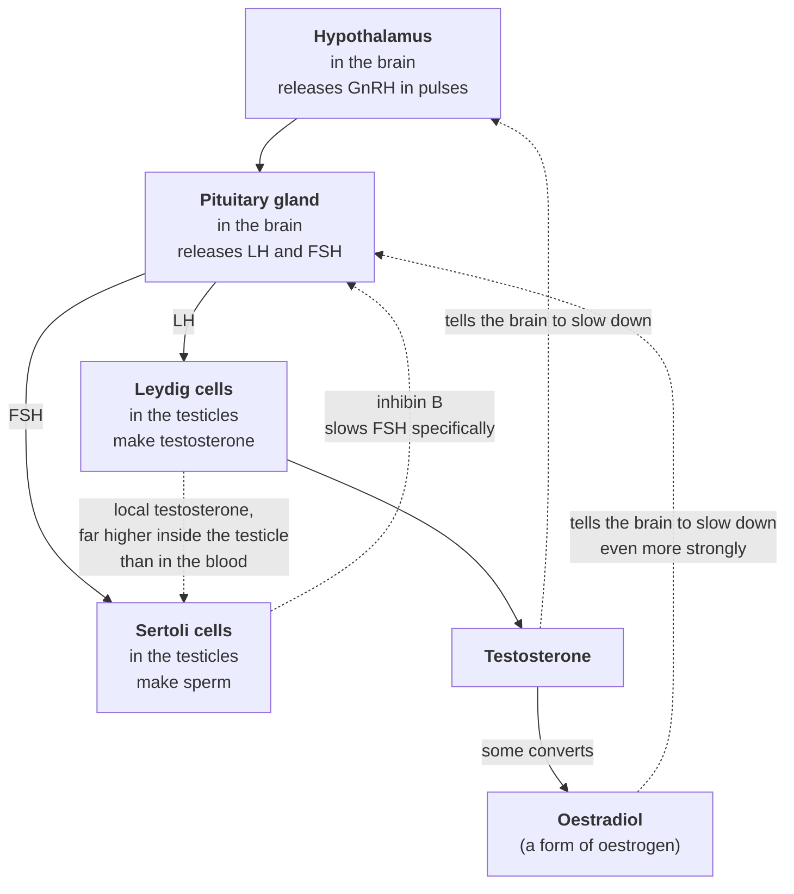

# How the system works

> **If you have chest pain, breathlessness, fainting, or swelling or pain in one
> leg, stop reading and call 999.** If you're having thoughts of harming
> yourself, Samaritans are on 116 123, free, any hour of any day.

## The short version

Your testosterone isn't controlled by your testicles. It's controlled by a loop
that runs between your brain and your testicles, in both directions. Understanding
that loop is the difference between staring at a blood test and reading one.

Most importantly: it explains why two men can have the same testosterone number
and have completely different problems.

## Start here: it's a thermostat

Think of a heating system.

A thermostat measures the temperature. If the room is cold, it tells the boiler to
fire. The boiler heats the room. The thermostat notices the room is now warm, and
tells the boiler to stop.

Your body runs testosterone the same way.

- **The thermostat** is in your brain — two parts of it, the hypothalamus and the
  pituitary gland.
- **The boiler** is your testicles.
- **The heat** is testosterone.

When testosterone is low, the brain sends a signal to make more. When testosterone
is high, the brain stops sending that signal. That's it. That's the whole idea,
and everything below is detail.

## The parts, in order

**The hypothalamus** releases a hormone called GnRH. It doesn't trickle it out
steadily — it fires in pulses, roughly every couple of hours. The pulsing matters.
A steady stream doesn't work; the pituitary stops listening.

**The pituitary** hears those pulses and releases two hormones into the blood:

- **LH** (luteinising hormone) — the "make testosterone" signal.
- **FSH** (follicle-stimulating hormone) — the "make sperm" signal.

**In the testicles**, two different types of cell are listening:

- **Leydig cells** respond to LH by making testosterone.
- **Sertoli cells** respond to FSH by supporting sperm production.

**Testosterone** then goes back round to the brain and turns the signal down. Some
of it is also converted into **oestradiol** — a form of oestrogen — by an enzyme
called aromatase. Men need oestradiol. It matters for bone, brain, mood and libido.
It is not a contaminant, and it is also a powerful part of the "turn it down"
signal, arguably stronger at the pituitary than testosterone itself.

**Sertoli cells** send back their own message, **inhibin B**, which turns down FSH
specifically.

## The one thing most people don't know

Inside the testicle, testosterone sits at a concentration far higher than anywhere
in your bloodstream. Sperm production needs that local concentration. It cannot run
on blood levels.

This is why a man can inject a large amount of testosterone, have a blood level
well above the normal range, feel strong — and produce no sperm at all. The blood
is full. The factory floor is empty. Injected testosterone raises the number in your
arm; it does nothing for the concentration inside the testicle, because that came
from LH stimulating Leydig cells, and LH is now switched off.

## What happens when testosterone comes from outside

Now put the thermostat back in your head.

You inject testosterone. Blood levels rise, often far above anything the body
would make. Some of it converts to oestradiol, so that rises too.

The brain reads both signals and concludes, entirely correctly, that there is far
too much. So it stops.

- GnRH pulses slow, then stop.
- LH and FSH fall, often to undetectable.
- Leydig cells lose their instruction and stop making testosterone.
- The testicles get smaller, because most of their bulk is sperm-producing tissue
  that is no longer being maintained.
- Sperm production drops or stops.

None of that is malfunction. The system is working exactly as designed. It has
been told there's plenty, and it has responded appropriately.

## Suppressed is not the same as broken

This distinction matters more than almost anything else on this page.

**Deficiency** is the body failing to make enough — the boiler is broken.

**Suppression** is the body correctly deciding to stop, because something is
arriving from outside — the boiler is fine, but the thermostat has been told the
room is hot.

They can look identical on a blood test if you only measure testosterone. They are
not the same situation, they don't have the same outlook, and they don't call for
the same response.

## How to tell where the problem is

This is the payoff, and it's the most useful thing on this page.

Look at testosterone and LH **together**.

| Testosterone | LH | What it usually points to |
|---|---|---|
| Low | **High** | The brain is shouting and the testicles aren't answering. The problem is at the testicle end. Doctors call this **primary**. |
| Low | **Low or undetectable** | Nobody is shouting. The signal itself is switched off. The problem is at the brain end. Doctors call this **secondary**. |
| Normal | Normal | The loop is running. If you still have symptoms, the answer may be elsewhere — see the section on SHBG below. |

After a long period of taking testosterone from outside, the usual picture is the
second one: low testosterone, low or undetectable LH. Secondary. The signal is off.

One number alone can't tell you this. Two numbers together can. That is the entire
reason a hormone panel has more than one line on it.

## Why "normal" testosterone can still leave you unwell

Testosterone doesn't float freely in your blood. Most of it is stuck to a carrier
protein called **SHBG** (sex hormone binding globulin), and while it's stuck to
SHBG, your body can't use it.

So there are two different numbers:

- **Total testosterone** — everything in there, used and unused.
- **Free testosterone** — the portion actually available to do its job.

If your SHBG is high, a large slice of your total is locked up. Your total can sit
comfortably inside the "normal" range while the amount your body can actually use
is low. You feel awful, and the report says normal.

Free testosterone usually isn't measured directly. It's calculated, from total
testosterone, SHBG and albumin. UK guidance from the Society for Endocrinology
notes that when SHBG is abnormal, total testosterone doesn't reliably reflect what
testosterone is actually doing in the body, and a calculated free testosterone is
the appropriate measure. *(Source pending approval:
`jayasena-2022-sfe-trt-guidelines`.)*

If you've been told your testosterone is normal but you don't feel it, this is one
of the first things worth asking about.

## What happens when you stop

The outside supply stops. Blood testosterone falls. The brain notices, and the
"turn it down" pressure lifts.

In principle the loop should start up again. In practice it varies enormously, and
this is where honest information gets thin.

What can reasonably be said:

- Recovery is not automatic and it is not quick.
- LH and FSH generally return before testosterone does — the signal comes back
  before the response to it.
- Research has found that men who had stopped using anabolic steroids still showed
  lower testosterone and more symptoms than comparable men **years** after stopping.
  *(Source pending approval: `rasmussen-2016-former-abusers`.)*
- How long any individual takes, and how completely they recover, is not something
  the current evidence can predict.

**Be very careful with recovery timelines you read anywhere, including here.**
Figures circulate — three months, six months — often lifted from studies of people
who used far less, for far less time, than the person reading them. A number taken
from the wrong population is worse than no number, because it sets an expectation
that then fails.

*STAN is holding one such figure back from publication for exactly this reason
until the underlying study population has been checked.*

## What this page does not tell you

- **Whether any of this applies to you.** This describes a system in general. It
  cannot account for your history, your bloods, or anything else about you.
- **What your own results mean.** Two men with identical numbers can need
  completely different things.
- **What to do.** There is nothing here about what to take, how much, or when, and
  there won't be. That is a conversation with a clinician who can see your full
  picture, and this page exists to make that conversation better, not to replace it.
- **How long anything takes.** See above.

## Questions worth asking

If you're going to a GP or a specialist appointment:

1. Have my LH and FSH been measured alongside my testosterone, and what do they
   show together?
2. What's my SHBG, and has a calculated free testosterone been worked out?
3. What time of day was my sample taken, and does that affect how you're reading it?
4. Does the picture look primary or secondary, and what does that mean for me?
5. If fertility matters to me, what should be assessed?

Our **consultation brief** lays this out as a sheet you can fill in and hand over.

## Related pages

Once these exist, each will go deeper on one part of the loop: LH · FSH ·
testosterone (total and free) · SHBG · oestradiol · inhibin B and AMH · prolactin ·
haematocrit.

---

**Sources for this page:** *pending — no cited record is approved yet.*

**Written by** R. (founder) · **Clinically reviewed by** — not yet reviewed —
**Version** 0.1 · **Status: DRAFT. Not for publication.**

*General information, not medical advice about you. STAN does not assess, diagnose
or prescribe. See our [scope of practice](../../governance/SCOPE.md).*
